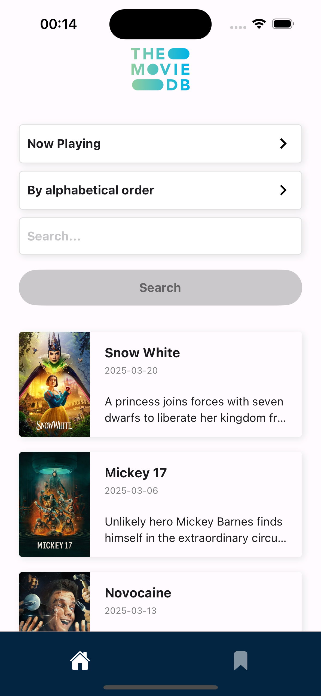
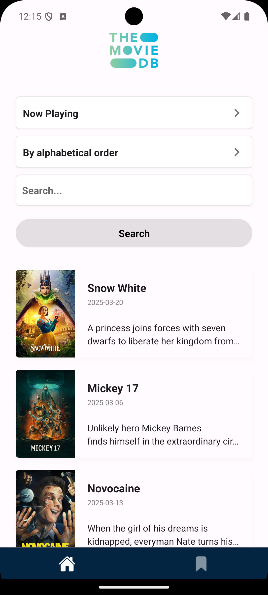

# Movie Test App

A React Native application for browsing and discovering movies.

## Table of Contents

- [Installation](#installation)
- [Running the App](#running-the-app)
- [Screenshots](#screenshots)
- [Todo List](#todo-list)

## Installation

### Prerequisites

- Node.js (v14 or newer)
- Yarn
- Xcode (for iOS development)
- Android Studio (for Android development)
- CocoaPods (for iOS dependencies)

### Install Dependencies

Clone the repository and install dependencies:

```bash
# Clone the repo
git clone <repository-url>
cd movieTest

# Install JavaScript dependencies
yarn install
```

### iOS Setup

Install CocoaPods dependencies:

```bash
cd ios
pod install
cd ..
```

### Android Setup

No additional steps required after installing the JavaScript dependencies.

## Running the App

### iOS

```bash
# Start the Metro bundler
yarn start

# In another terminal, run the iOS app
yarn ios
```

### Android

```bash
# Start the Metro bundler
yarn start

# In another terminal, run the Android app
yarn android
```

## Screenshots

### iOS




### Android




## Todo List

- [ ] Create movie listing screen
- [ ] Implement movie details screen
- [ ] Add search functionality
- [ ] Integrate with movie API
- [ ] Implement favorites feature
- [ ] Add user authentication
- [ ] Create settings screen
- [ ] Implement dark mode
- [ ] Add offline support
- [ ] Implement deep linking

## License

This project is licensed under the MIT License - see the LICENSE file for details.
