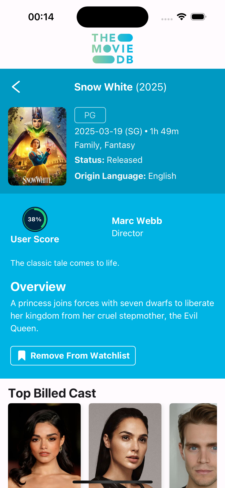
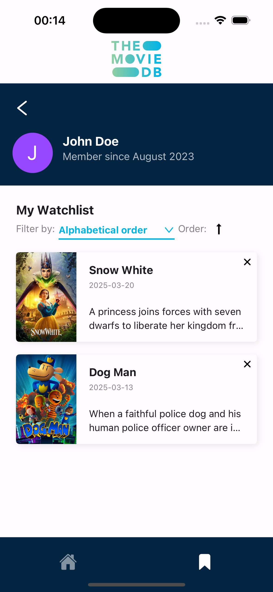
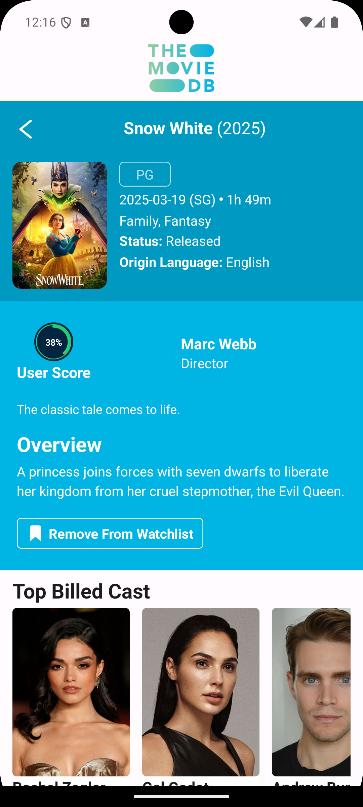
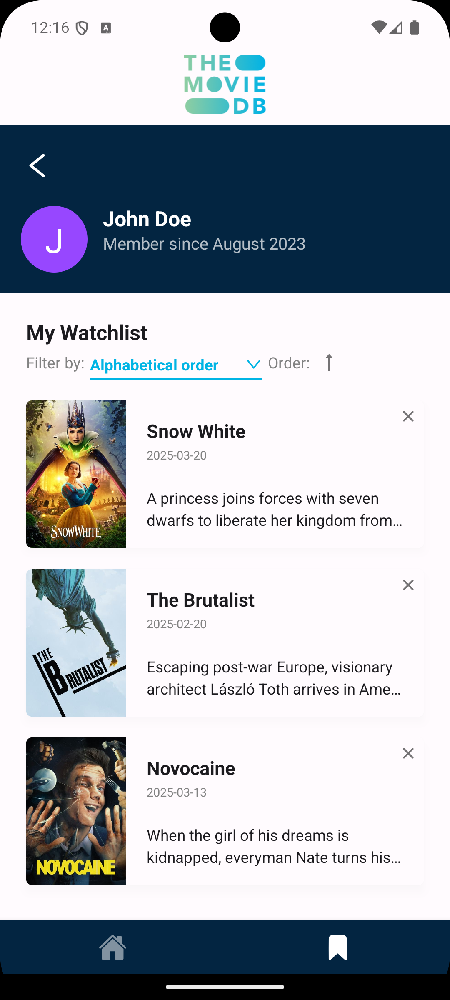

# Movie Test App

A React Native application for browsing and discovering movies.

## Table of Contents

- [Installation](#installation)
- [Running the App](#running-the-app)
- [Screenshots](#screenshots)
- [Todo List](#todo-list)

## Installation

### Prerequisites

- Node.js (v14 or newer)
- Yarn
- Xcode (for iOS development)
- Android Studio (for Android development)
- CocoaPods (for iOS dependencies)

### Install Dependencies

Clone the repository and install dependencies:

```bash
# Clone the repo
git clone <repository-url>
cd movieTest

# Install JavaScript dependencies
yarn install
```

### iOS Setup

```bash
# Navigate to the iOS directory
cd ios

# Install pod dependencies
pod install

# Return to the project root
cd ..
```

> ⚠️ Always run `pod install` after pulling new changes or updating JavaScript dependencies that include native iOS code.

### Android Setup

No additional steps required after installing the JavaScript dependencies.

## Running the App

### iOS

```bash
# Start the Metro bundler
yarn start

# In another terminal, run the iOS app
yarn ios
```

### Android

```bash
# Start the Metro bundler
yarn start

# In another terminal, run the Android app
yarn android
```

## Screenshots

### iOS

<div style="display: flex; flex-wrap: wrap; gap: 10px;">
  
  
  
</div>

### Android

<div style="display: flex; flex-wrap: wrap; gap: 10px;">
  
  
  
</div>

## Todo List

- [ ] Integrate watchlist api.
- [ ] Integrate recommendations api.
- [ ] Implement recommendations UI.
- [ ] Implement watchlist filter and sort.
